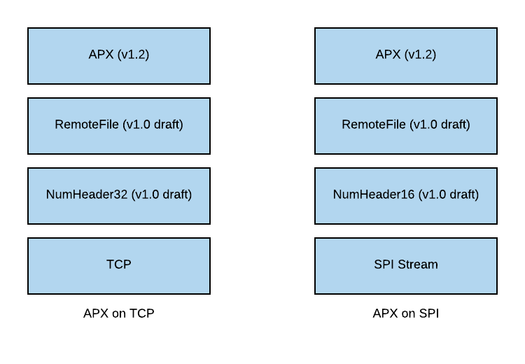

APX
===

APX is a set of protocols, toolchains and libraries used for sending automotive signals on sockets and SPI buses.

Documentation
-------------
Documentation is in early stages and can be found `here <http://apx.readthedocs.io/en/latest/>`_

The APX protocol stack
----------------------

Sub-projects
------------

This repository contains only contains documentation. See the sub-projects below for implementations.

`APX for C <https://github.com/cogu/c-apx>`_
~~~~~~~~~~~~~~~~~~~~~~~~~~~~~~~~~~~~~~~~~~~~~

Main implementation of APX.

* APX server (TCP)
* APX client (TCP, SPI Bus using APX-ES)
* Windows compiler support:

  - Visual Studio (2010/2013/2015/2017)
  - GCC (any version) using Cygwin (MakeFile and Eclipse projects included)

* Linux compiler support:

  - GCC (any version)

* Embedded compiler support (verified so far):

  - Green Hills (V850)

`APX for Qt <https://github.com/cogu/qt-apx>`_
~~~~~~~~~~~~~~~~~~~~~~~~~~~~~~~~~~~~~~~~~~~~~~

Qt 5 implementation of APX client for integration with Qt/QML.

`APX for C# <https://github.com/fousk/cs-apx>`_
~~~~~~~~~~~~~~~~~~~~~~~~~~~~~~~~~~~~~~~~~~~~~~~~~

C# implementation of APX client.

`APX for Excel <https://github.com/cogu/xl-apx>`_
~~~~~~~~~~~~~~~~~~~~~~~~~~~~~~~~~~~~~~~~~~~~~~~~~

VB7.1 implementation of APX client for Excel.

`APX for Python3 <https://github.com/cogu/py-apx>`_
~~~~~~~~~~~~~~~~~~~~~~~~~~~~~~~~~~~~~~~~~~~~~~~~~~~

The APX toolchain (parsers, code generators etc.). The Python APX client support is partially implemented.
