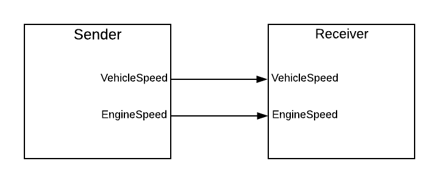
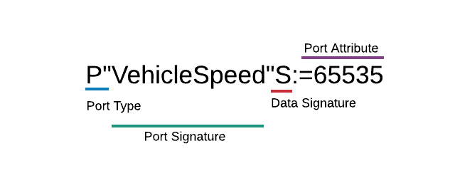

APX Text
========

.. toctree::
   :maxdepth: 2
   :hidden:

.. highlight:: none

APX Text is a data definition language used to describe the signals sent from and received to a software component. APX files uses the .apx file extension.

Example (Example.apx)::

   APX/1.2
   N"Example"
   T"VehicleSpeed_T"S
   T"EngineSpeed_T"S
   P"VehicleSpeed"T[0]:=65535
   P"EngineSpeed"T[1]:=65535

Components
----------

Software components are blocks which encapsulates a related set of function or data (high cohesion).
In the automotive industry they typically communicate with each other using signals.
If a component is sending a signal it is said to be a *provider* of the signal. On component level this is indicated by provide (or output) ports.
If a component is receiving a signal it is said to be a *requester* of the signal. On component level this is indicated by require (or input) ports.

Example Sender-Receiver
~~~~~~~~~~~~~~~~~~~~~~~

The Sender component (which has the name "Sender") provides the following signals:

+--------------+-----------+---------------+
|   Name       | Data Type | Initial Value |
+==============+===========+===============+
| VehicleSpeed |   uint16  |     65535     |
+--------------+-----------+---------------+
| EngineSpeed  |   uint16  |     65535     |
+--------------+-----------+---------------+

The Receiver component (which has the name "Receiver") requires the following signals:

+--------------+-----------+---------------+
|   Name       | Data Type | Initial Value |
+==============+===========+===============+
| VehicleSpeed |   uint16  |     65535     |
+--------------+-----------+---------------+
| EngineSpeed  |   uint16  |     65535     |
+--------------+-----------+---------------+

The Sender component has two provide ports and can be represented in APX Text as follows::

   APX/1.2
   N"Sender"
   P"VehicleSpeed"S:=65535
   P"EngineSpeed"S:=65535

Line 1: This is the file header, it says that this is an APX file and that the version is 1.2 (current version).

Line 2: The letter N represents an APX Node line. The name of the node is "Sender". Note that in APX we use the term *node* instead of *software component*.

Line 3: The letter P represents a provide port line. The name of the port is VehicleSpeed and its type is uint16. The initial value is 65535.

Line 4: This is another provide port line. This one has the name EngineSpeed and its type is also uint16. The initial value is 65535.

Similarly, the Receiver component has two require ports and can be represented in APX Text as follows::

   APX/1.2
   N"Receiver"
   R"VehicleSpeed"S:=65535
   R"EngineSpeed"S:=65535

Port Lines
----------

Port lines consists of several parts:

- Port Type
- Port Signature
 
  - Port Name
  - Data Signature

- Port Attributes

Examples:

+-----------------------------+-----------+-------------------------+----------------+-----------------+
| Port Line                   | Port Type |   Port Signature        | Data Signature | Port Attributes |
+=============================+===========+=========================+================+=================+
| P"VehicleSpeed"S:=65535     |   Provide | "VehicleSpeed"S         | S              | =65535          |
+-----------------------------+-----------+-------------------------+----------------+-----------------+
| R"EngineSpeed"S:=65535      |   Require | "EngineSpeed"S          | S              | =65535          |
+-----------------------------+-----------+-------------------------+----------------+-----------------+
| P"ParkBrakeStatus"C(0,3):=3 |   Provide | "ParkBrakeStatus"C(0,3) | C(0,3)         | =3              |
+-----------------------------+-----------+-------------------------+----------------+-----------------+

Port Type
~~~~~~~~~

Port type is a single character where P stands for (start of) Provide port and R stands for (start of) Require port.

Port Signature
~~~~~~~~~~~~~~

The port signature is the port name and data signature combined (with its port direction removed).

Data Signature
~~~~~~~~~~~~~~

The data signature is also known as the data type. It can be a simple, one-letter character or it can be a complex data type or even a type reference.

Primitive types
^^^^^^^^^^^^^^^

::

   a: string (null-terminated ASCII string)
   c: sint8  (signed 8-bit value)
   s: sint16 (signed 16-bit value)
   l: sint32 (signed 32-bit value)
   u: sint64 (signed 64-bit value)
   C: uint8  (unsigned 8-bit value)
   S: uint16 (unsigned 16-bit value)
   L: uint32 (unsigned 32-bit value)
   U: uint64 (unsigned 64-bit value)

Examples::

   P"OutPort1"c:=127 #Provide port with type sint8 and initial value 127
   P"OutPort2"C:=255 #Provide port with type uint8 and initial value 255
   R"InPort1"s:=-1   #Require port with type sin16 and initial value -1
   R"InPort2"S       #Require port with type uint16 and no initial value (which defaults to 0)
  
Min/Max Value Range
^^^^^^^^^^^^^^^^^^^

Each primitive type can have an optional min/max value range appended to it. This is done by adding **(min,max)** to the right of the primitive type.

Any port which as no min/max range simply assumes that the entire range of the underlying data type is a valid range

Examples::

   R"IsEngineRunning"C(0,1)      #type:uint8, min:0, max:1
   R"UnitSelection"C(0,3)        #type:uint8, min:0, max:3
   P"LightSensorValue"S(0,10000) #type:uint16, min:0, max:10000
   P"U8Signal"C                  #type: uin8, min:0, max:255 (implicit)
   P"U16Signal"S                 #type: uin8, min:0, max:65535 (implicit)

Min/max range is part of the port/data signature. The following 2 port signatures are **not** the same.
Since the second signal has no min/max range, it gets implictly treated as if it said C(0,255), which is the full range of its data type (uint8 in this case).

::
   
   R"LowFuelLevelWarning"C(0,3)  #This is not the same
   R"LowFuelLevelWarning"C       # as this one

   

Array Types
^^^^^^^^^^^

Arrays can be constructed by appending **[n]** to the right of any data type where **n** is represents the array length.

In case of strings, using the *a* character the array length represents the maximum number of bytes the character can contain.
For short strings, when not all bytes are used, the unused bytes will automatically be set to value zero, or NULL.

Examples::

  P"Name"a[40]:=""  #type: string, number of bytes: 40
  R"U16Value"S[4]   #type: uint16, array-length: 4 (uses 8 bytes of memory)
  P"U32Value"L[3]   #type: uint32, array-length: 3 (uses 12 bytes of memory)
  
When combining with min/max range you should place **(min,max)** to the left of **[n]**.

Example::

   P"SpeedSettings"C(0,3)[4] #array of 4 uint8 integers where each has min=0 and max=4.

Record Types
^^^^^^^^^^^^

TBD

Type References
^^^^^^^^^^^^^^^

TBD

Port Attributes
~~~~~~~~~~~~~~~

Port attributes are an optional part of the port line. They are most often used to set the initial (or default) value of the port
but can also be used to set queued port attributes as well as parameter attributes.

Port attributes are always placed at the very end of the port line, after the data signature.
Use a **:** character to mark the end of the data signature and start of the port attribute.
The **:** character is not part of the actual attribute, it is merely used as a separator.

Examples:: 

   R"VehicleSpeed"S:=65535 #Init value: 65535
   R"UnitSelection"C(0,3):=3  #Init value: 3

Initial value
^^^^^^^^^^^^^

Initial value, init value or default value uses the **=** character as the first character to say "here starts the inital value".

Remember:

- The **:** character is the separator between port signature and port attribute
- The **=** character act as the first character of the initial value.

Examples::

   =7                #init value: 7
   =255              #init value: 255
   ={255, 255, 255}  #Init value: {255, 255, 255}
